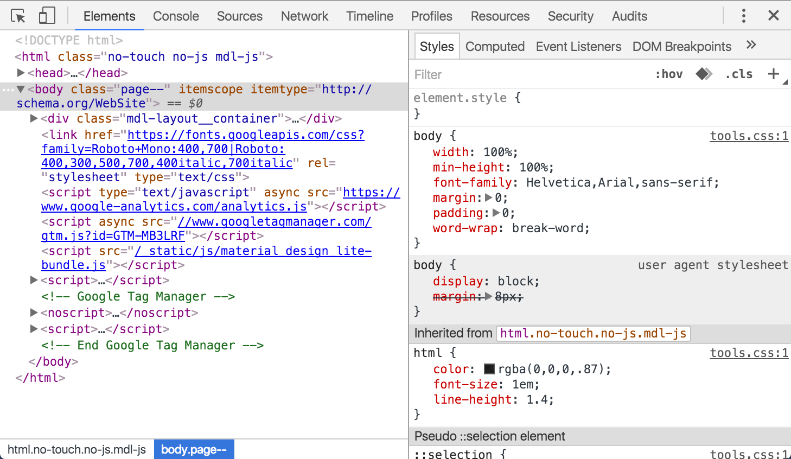
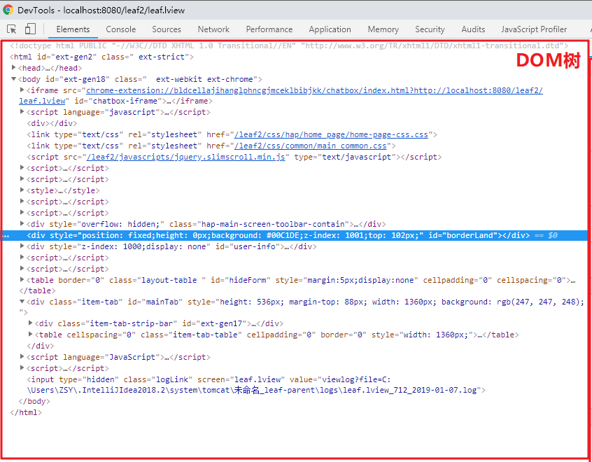
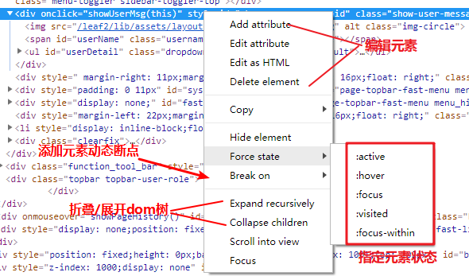
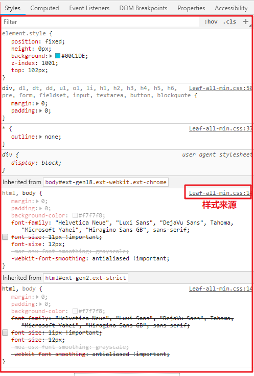
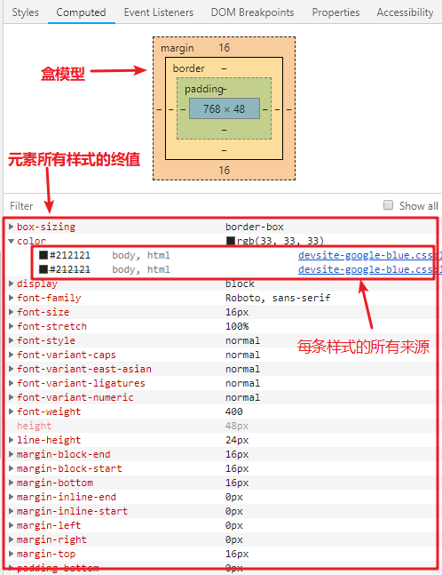
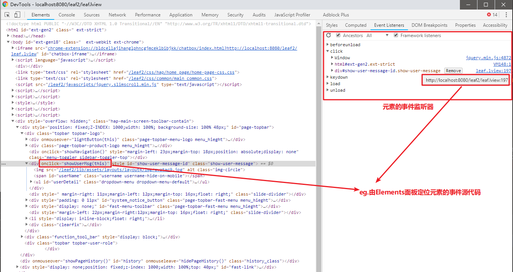
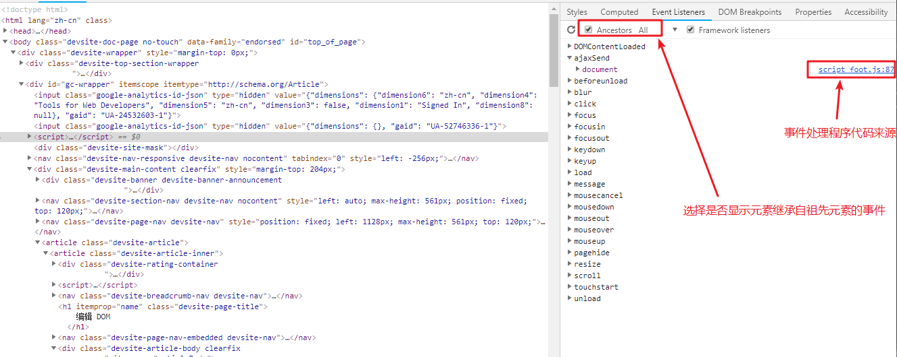
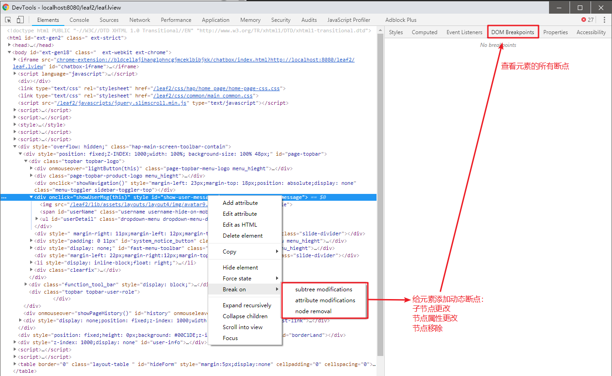
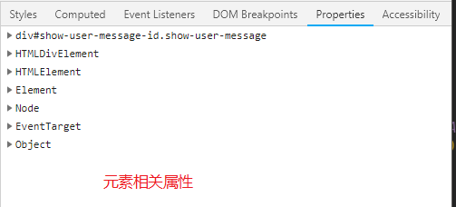

# Elements 元素面板

使用 Chrome DevTools 的 Elements 面板检查和实时编辑页面的 HTML 与 CSS

## DOM 树

在元素面板左侧是当前页的 DOM 树

可以进行以下操作：

-   直接增/删/改/复制/拖放移动 DOM 元素，查看实时效果(非持久化)
-   添加元素断点
-   模拟元素 focus/hover/actice 等状态
-   选中元素后通过右键“Scroll into view”突出显示当前元素在页面的位置
-   按快捷键**h**来快速隐藏/显示元素(原理是 visibility 设为 hidden,不影响其他元素不引起重绘)
    

## Styles

在面板右侧 Styles 窗格中，会显示节点的各级样式，每级样式的来源，每条样式属性是否命中

可以直接增/删/改元素样式，查看实时效果(非持久化)

## Computed

在面板右侧 Computed 窗格中可以查看：

-   元素的盒模型(双击可编辑)
-   元素所有样式的**计算后最终值**(即最终实际应用到元素的值)

点开每一条最终值，可以看到所有该条样式的规则，以及代码来源

勾选**show all**选项，会同时列出元素继承到的样式

## Event Listeners

在 Event Listeners 窗格中，可以看到元素的事件监听器

例如"load","DOMContentLoaded","click"等，以及每个事件对应的事件处理函数

在源代码中加 **行 debugger 断点**，或者**debug(函数)断点**(Sources 面板会提及这两种断点)，是需要维护成本的，有时候还会忘记删除；

或者你想调试别人开发的 你不拥有源代码的 网页；

这些时候可以利用 Event Listeners 窗格快速定位**事件函数代码**并调试。

## DOM Breakpoints

在面板右侧 DOM Breakpoints 中，可以查看**元素断点**

相应的在左侧 DOM 树右键点击元素，可以给元素添加断点

元素断点有三种类型：属性修改，子树变更，节点删除

例如添加“node removal”断点，就会在 有代码移除当前节点时，在当前行代码执行前暂停执行，并自动转换到 Sources 面板，以便做进一步调试

## Properties

Properties 面板会列出元素 DOM 底层相关属性

# 相关

-   本文作者：ScarSu
-   [全系列文链接](https://www.scarsu.com/categories/devtools%E8%80%81%E5%8F%B8%E6%9C%BA%E5%85%BB%E6%88%90%E7%B3%BB%E5%88%97%E6%96%87%E7%AB%A0/)
-   本文基于最新版 chrome 浏览器总结,大多数特性也适用于其他主流浏览器
-   本文目的：新手入门 & 给已经了解 Devtools 的人建立完善的知识结构
-   [参考 1:官方文档](https://developers.google.com/web/tools/chrome-devtools/)
-   [参考 2：来自作者 Tomek Sułkowski 在 medium 的系列文章](https://medium.com/@tomsu)
