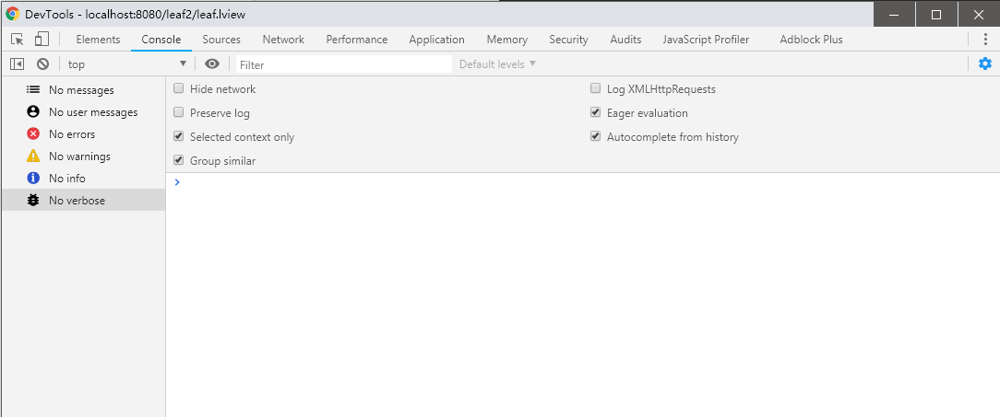
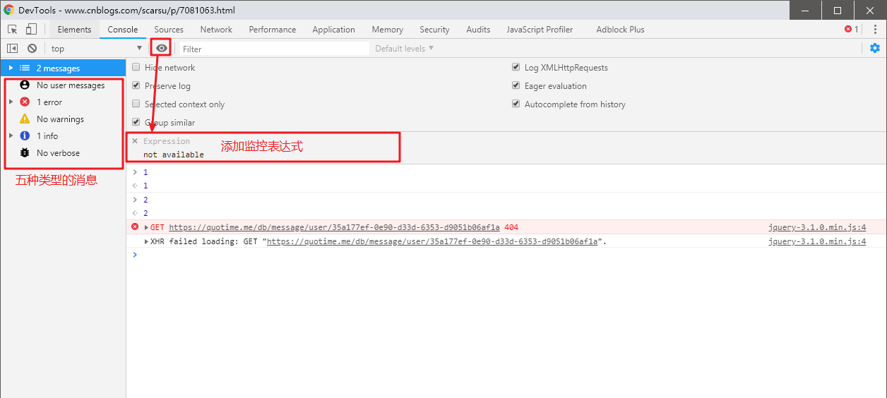
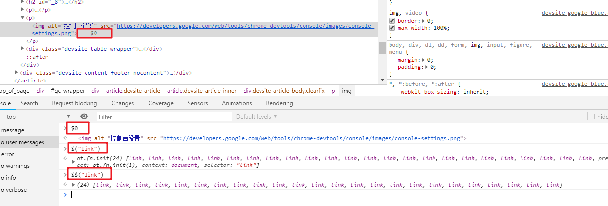
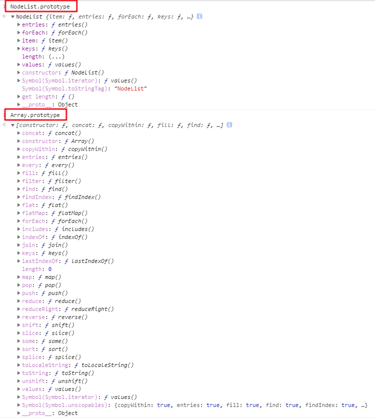
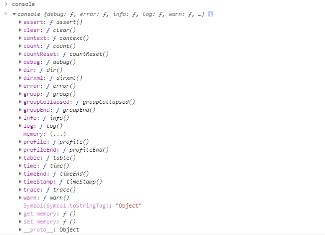
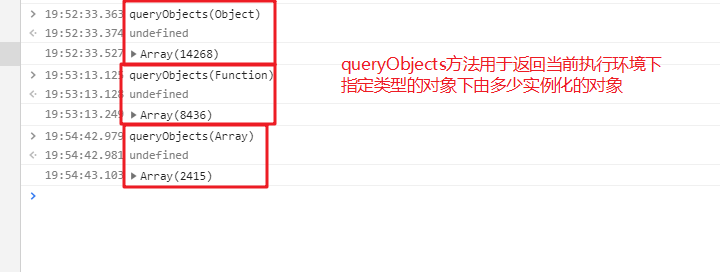
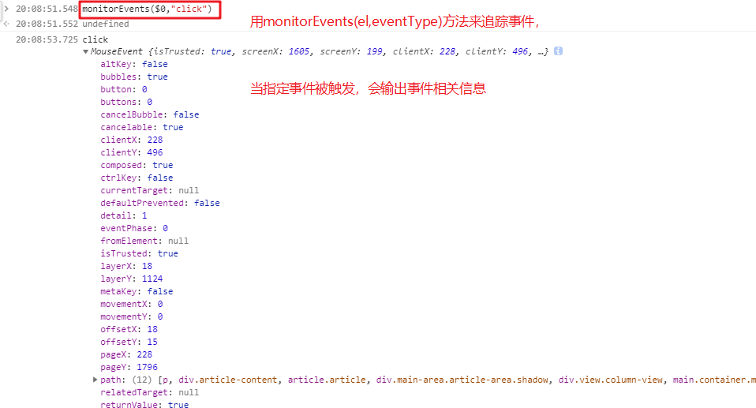

# Console 控制台面板

Console 面板是浏览器的控制台，也是 Devtools 的灵魂。

可以通过**设置->Show Console drawer**或者**Esc 快捷键**让 Console 在每个面板都能显示。


## message

在 console 中，可以看到来自**浏览器**/**代码**的五种类型的信息：

-   user message
-   error
-   warning
-   info
-   verbose

相同的消息默认是堆叠的，可以通过 ctrl+shift+p 输入 time 命令或者设置中找到**timestamps**命令，给消息加上时间戳

-   通过选项**Log XMLHttpRequest**选择是否输出所有 XMLHttp 请求日志(可以监控页面所有 ajax 请求及其代码调用栈)
-   通过**Hide network**选择显示/隐藏网络请求的错误信息(例如 GET xxx 404)
-   通过**Preserve log**选择保留历史记录，即刷新页面后是否还显示先前的消息
    

## javascript 实时执行环境

console 除了能输出调试信息，也是一个 javascript 实时执行环境：


可以直接在这里输入任何**全局变量名**/内置对象名/函数名，会得到相应的值输出;在调试环境下的断点内，可以获取**局部变量**值

右键选**Store as global variable**，可以将输出值存储为一个全局变量

双击对象的属性值，可以直接更改这个对象（持久化的更改,因为 console 存储下来的是对象的引用）

console 中的`$`符号：

-   可以通过`$0`，获取当前在 Elements 面板所选中的元素节点
-   如果 `$` 在当前页面没被占用，可以用来替代 document.querySlector 方法使用
-   `$$` 是 document.querySelectorAll 方法的更佳替代，因为 document.querySelectorAll 返回的是 nodeList(NodeList)，而`\$$`能直接返回数组(Array)
    

NodeList 和 Array 的区别可以从下图看出一部分，比起 Array.prototype.slice.call(nodeList)进行转换的操作，顺手很多


-   `$_`可以返回上一次执行的结果
    

-   如果需要使用 npm 的包，可以安装 Console Importer 插件，用`$i`方法引入 npm 中的库
    

## console 下的方法：

-   除了被用烂了的`console.log()`（当然 console.log 也有特别一点的用法）
    

-   console 对象还有 console.error/clear/debug/count/time/table/tarce 等等方法
-   直接在 console 中输入 console，可以看到 console 对象下的所有方法
    

-   例如 console.table(obj)可以把你的对象以可视化的表格形式进行输出
    

-   例如可以使用 console.time()和 console.timeEnd()方法来测量时间差
    

-   另:console 命令行还内置了一些 API 方法，例如 queryObjects(),可以返回指定类型的对象下由多少实例化的对象
    

-   monitor(function)方法来追踪函数调用信息
    

-   monitorEvents(el,eventType)方法来追踪事件
    

## 选择执行环境

可以通过左上的下拉列表，选择不同的**执行环境**


top 是最外层的顶级页面,其他的是 iframe 子页面

默认情况下

-   子 frame 中：

```
window===self===self.window
top.window是顶级页面top的全局变量window
```

-   top frame 中：

```
window===self===self.window===top===top.window
```

# 相关

-   本文作者：ScarSu
-   [全系列文链接](https://www.scarsu.com/categories/devtools%E8%80%81%E5%8F%B8%E6%9C%BA%E5%85%BB%E6%88%90%E7%B3%BB%E5%88%97%E6%96%87%E7%AB%A0/)
-   本文基于最新版 chrome 浏览器总结,大多数特性也适用于其他主流浏览器
-   本文目的：新手入门 & 给已经了解 Devtools 的人建立完善的知识结构
-   [参考 1:官方文档](https://developers.google.com/web/tools/chrome-devtools/)
-   [参考 2：来自作者 Tomek Sułkowski 在 medium 的系列文章](https://medium.com/@tomsu)
